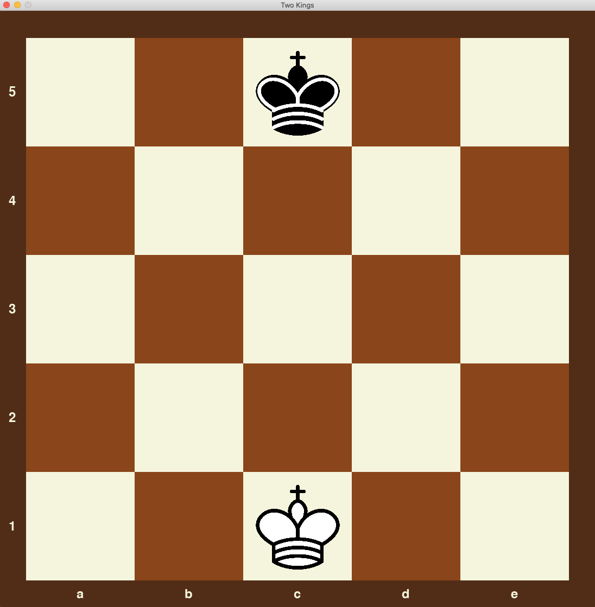

# AlphaZero Mini

AlphaZero Mini is a project that implements a simplified version of the AlphaZero algorithm to train a neural network to play board games via self-play and reinforcement learning.

## Overview

This project provides a framework for training an AI to play board games using the core principles of the AlphaZero algorithm. It includes a neural network architecture, Monte Carlo Tree Search implementation, and a training pipeline. As a demonstration, it comes with a simple chess-like game called "Two Kings" that can be played against the trained AI.

## Main Components

- [network.py](network.py): Defines the convolutional neural network architecture used for game play. The network includes both a policy head and a value head.
- [mcts.py](mcts.py): Implements the Monte Carlo Tree Search algorithm used by AlphaZero during both training and inference.
- [train.py](train.py): Contains the code for training the neural network through self-play and reinforcement learning.
- [two_kings.py](two_kings.py): Provides a board game environment for a simplified version of chess with only two kings on a 5x5 board. This module can also be run as a script to play against the trained AI via a GUI.

## Two Kings Game

The Two Kings game is a simplified chess variant used to demonstrate the capabilities of the AlphaZero Mini system. The game is played between two kings on a 5 by 5 board. The kings can only move horizontally and vertically, and the objective is simply to take your opponent's king. If no one wins in 10 moves the game is declared a draw. Perfect play results in a black win in 5 moves. Here's what the game looks like:

